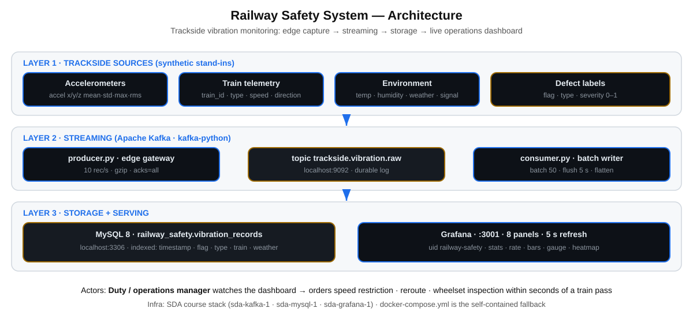
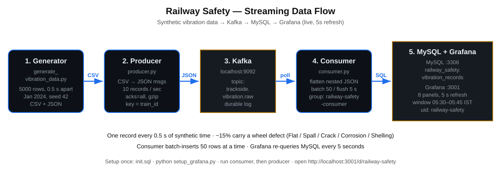
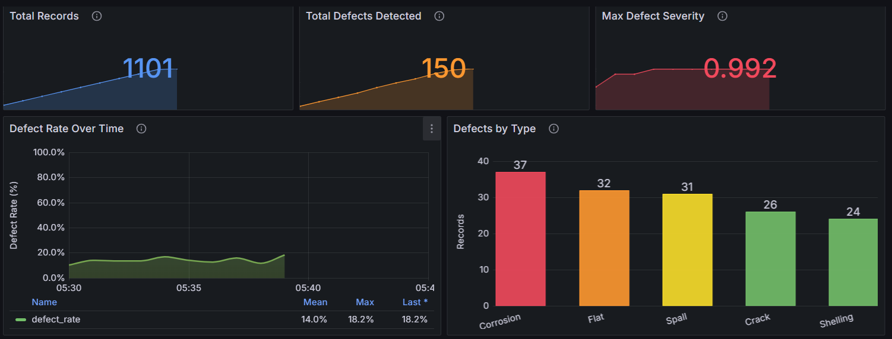
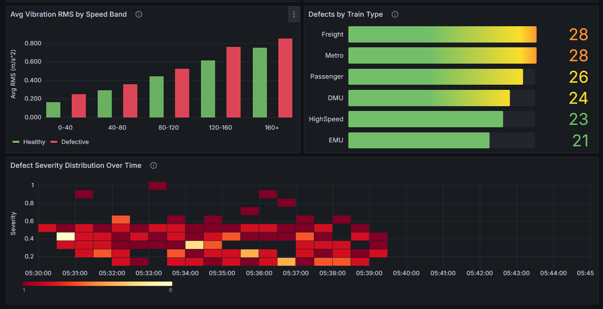

# Railway Safety System — Real-Time Trackside Vibration Monitoring for Wheel Defect Detection

> Streaming analytics project: synthetic trackside accelerometer data → Apache Kafka → MySQL → Grafana live dashboard (`http://localhost:3001/d/railway-safety`) for real-time railway safety decisions.

**Author:** Satyam Pani (MBA2025-102) · Industry: Railway Maintenance · Academic use only

---

## Contents

1. [Executive Summary](#1-executive-summary)
2. [Problem & Business Decision](#2-problem--business-decision)
3. [Project Architecture](#3-project-architecture)
4. [Data Flow](#4-data-flow)
5. [Data Model](#5-data-model)
6. [Storage — MySQL](#6-storage--mysql)
7. [Streaming — Kafka Producer & Consumer](#7-streaming--kafka-producer--consumer)
8. [Visualisation — Grafana on localhost:3001](#8-visualisation--grafana-on-localhost3001)
9. [Dashboard Screenshots](#9-dashboard-screenshots)
10. [Graph Explanations & Business Insights](#10-graph-explanations--business-insights)
11. [End-to-End Runbook](#11-end-to-end-runbook)
12. [Verification](#12-verification)
13. [Troubleshooting](#13-troubleshooting)
14. [Repository Map](#14-repository-map)
15. [Appendix A — Complete SQL Reference](#appendix-a--complete-sql-reference-every-graph-query-verbatim)

---

## 1. Executive Summary

Indian Railways runs one of the world's densest rail networks — millions of passengers and thousands of freight trains daily. A cracked wheel or flat spot noticed one journey too late can cause a derailment. Daily batch reports discover such defects **after** the journey is over.

This project builds a **streaming pipeline that flags wheel defects as a train passes a trackside monitoring checkpoint, within seconds**:

1. `generate_vibration_data.py` synthesises 5,000 realistic vibration records (accelerometer statistics, speed, environment, defect labels, one record every 0.5 s of synthetic time).
2. `producer.py` streams them as JSON through Kafka topic `trackside.vibration.raw` at ~10 records/sec.
3. `consumer.py` consumes the topic and batch-writes to MySQL table `railway_safety.vibration_records` (50 rows per batch).
4. The Grafana dashboard **"Railway Safety – Trackside Vibration Monitor"** (`uid: railway-safety`, 8 panels, 5 s refresh) queries MySQL live on `http://localhost:3001/d/railway-safety`.

The duty manager watches defect rate, severity, defect-type and fleet breakdowns, and a vibration-physics comparison — and can **immediately impose a speed restriction, reroute, or order a wheelset inspection** instead of waiting for tomorrow's report.

---

## 2. Problem & Business Decision

- Wheel defects (**Flat, Spall, Crack, Corrosion, Shelling**) change the vibration signature of a passing train.
- Trackside accelerometers (5–20 kHz) + acoustic sensors (44.1 kHz) + RFID train-ID readers + onboard telemetry (speed, axle load, temperature, GPS) + maintenance logs together produce megabytes per train pass.
- Batch processing cannot act in time; streaming analytics (producer → topic → consumer → dashboard) can.

**Business decision enabled:** *immediately restrict speed / reroute / inspect a train showing a severe defect score at a checkpoint — preventing derailments, emergency repairs, and schedule collapse on a high-density network.*

---

## 3. Project Architecture

Three layers — sources, streaming, storage + serving — all running on the standard SDA course Docker stack, calibrated to **`localhost:3001`** (Grafana), **`localhost:9092`** (Kafka), **`localhost:3306`** (MySQL).



### 3.1 Technology stack

| Layer | Technology | Role in this project |
|---|---|---|
| Data synthesis | Python, `pandas`, `numpy`, `scipy`, `faker` | Physics-based vibration signals per defect type, seeded (`seed=42`) for reproducibility |
| Streaming | Apache Kafka, `kafka-python` | Durable topic `trackside.vibration.raw`; producer (gzip, `acks=all`) / consumer group `railway-safety-consumer` |
| Storage | MySQL 8.0, `mysql-connector-python` | `railway_safety.vibration_records`, indexed on timestamp / defect flag / type / train / weather |
| Visualisation | Grafana 11 (Stat, Time series, Bar chart, Bar gauge, Heatmap) | Live SQL against MySQL, 5 s refresh, fixed 05:30–05:45 IST window, `mysql-railway` datasource |
| Setup glue | `setup_grafana.py` (stdlib `urllib` only) | Creates the datasource + imports the dashboard via the Grafana HTTP API on `:3001` |
| Infra | SDA course stack (`sda-kafka-1`, `sda-mysql-1`, `sda-grafana-1`); `docker-compose.yml` fallback | No extra infra needed while the course stack runs |

### 3.2 Key addresses (all calibrated to localhost:3001)

| Component | Address | Credential |
|---|---|---|
| Grafana dashboard | `http://localhost:3001/d/railway-safety` | `admin` / `admin` |
| Grafana datasource `mysql-railway` | `host.docker.internal:3306` (reachable from inside the Grafana container), database `railway_safety` | `root` / `root` |
| Kafka broker / topic | `localhost:9092` / `trackside.vibration.raw` | — |
| MySQL table | `localhost:3306`, `railway_safety.vibration_records` | `root` / `root` |

> `setup_grafana.py` targets `http://localhost:3001` and registers the datasource URL as `host.docker.internal:3306`, because `sda-grafana-1` runs inside Docker and `localhost` from its point of view is the Grafana container itself. The `docker-compose.yml` fallback instead uses the in-network alias `mysql:3306` (see `grafana/provisioning/datasources/mysql.yml`).

---

## 4. Data Flow



1. **Generate** — `generate_vibration_data.py` emits 5,000 rows starting `2024-01-01 00:00:00 UTC`, one every 0.5 s (≈42 min of synthetic traffic), ~15% carrying a defect label. Output: `trackside_vibration_raw.csv` + `.json` (git-ignored; regenerate any time).
2. **Produce** — `producer.py` (edge gateway) reads the CSV, nests each row back into JSON (`acceleration`, `vibration_features`, `environment`, `defect` blocks, keyed by train ID) and publishes at 10 records/sec with `acks=all`, gzip compression and 3 retries.
3. **Buffer** — Kafka topic `trackside.vibration.raw` durably logs every message, decoupling ingest speed from database writes.
4. **Consume** — `consumer.py` (group `railway-safety-consumer`) flattens each message to a flat row (`flatten_record()`), skips malformed messages with a warning, and `executemany`-inserts batches of 50 (or every 5 s, whichever comes first) with commit/rollback and throughput logging.
5. **Serve** — Grafana re-queries MySQL every 5 s through the `mysql-railway` datasource and renders 8 panels locked to the 05:30–05:45 IST window (00:00–00:15 UTC).

---

## 5. Data Model

| Group | Fields |
|---|---|
| Identity | `record_id` (UUID), `timestamp` (ISO-8601), `sensor_id` (e.g. `SENS_7912`), `sensor_location` (e.g. `KM_151200_Between_Dejvicka_Borislavka`), `train_id`, `train_type` (Passenger, Freight, Metro, EMU, DMU, HighSpeed), `direction`, `track_section_id` |
| Motion | `speed_kmh` (type-dependent: Freight 20–80 … HighSpeed 120–180), `sampling_rate_hz` (5000–20000) |
| Vibration | `acceleration_{x,y,z}_{mean,std,max,rms}` (m/s²), `vibration_kurtosis`, `vibration_skewness`, `peak_to_rms_ratio` |
| Environment | `temperature_c`, `humidity_pct`, `weather_condition` (Clear, Cloudy, Rain, Fog, Extreme_Heat, Windy), `signal_quality` (0–1) |
| Defect label | `wheel_defect_flag` (~15% true), `defect_type` (None/Flat/Spall/Crack/Corrosion/Shelling), `defect_severity` (0.0–1.0) |

**Time range in the data:** one record every **0.5 s** from `2024-01-01 00:00:00 UTC`. The full 5,000-row file spans 00:00:00 → 00:41:39 UTC. The dashboard is deliberately focused on **05:30–05:45 IST** (00:00–00:15 UTC — the browser adds +5:30), and every panel hard-codes that window so no later timestamps can ever appear.

**Synthesis logic:** base signal = 50/100/150 Hz sines scaled by speed, plus defect-specific transients (Flat = periodic impacts, Spall = random bursts, Crack/Corrosion/Shelling = harmonic distortion + noise). Healthy vs defective RMS separation is what Panel 6 visualises.

---

## 6. Storage — MySQL

`init.sql` (run once; `consumer.py` re-issues the same `CREATE TABLE IF NOT EXISTS` as a safety net):

```sql
CREATE DATABASE IF NOT EXISTS railway_safety
  CHARACTER SET utf8mb4 COLLATE utf8mb4_unicode_ci;
USE railway_safety;
CREATE TABLE IF NOT EXISTS vibration_records (
    id INT AUTO_INCREMENT PRIMARY KEY,
    record_id VARCHAR(36) NOT NULL,
    timestamp DATETIME NOT NULL,
    sensor_id VARCHAR(20), sensor_location VARCHAR(100),
    train_id VARCHAR(10), train_type VARCHAR(20), direction VARCHAR(15),
    speed_kmh FLOAT,
    acceleration_x_mean FLOAT,  acceleration_y_mean FLOAT,  acceleration_z_mean FLOAT,
    acceleration_x_std  FLOAT,  acceleration_y_std  FLOAT,  acceleration_z_std  FLOAT,
    acceleration_x_max  FLOAT,  acceleration_y_max  FLOAT,  acceleration_z_max  FLOAT,
    acceleration_x_rms  FLOAT,  acceleration_y_rms  FLOAT,  acceleration_z_rms  FLOAT,
    vibration_kurtosis FLOAT, vibration_skewness FLOAT, peak_to_rms_ratio FLOAT,
    sampling_rate_hz INT, temperature_c FLOAT, humidity_pct FLOAT,
    wheel_defect_flag BOOLEAN DEFAULT FALSE,
    defect_type VARCHAR(20) DEFAULT 'None',
    defect_severity FLOAT DEFAULT 0,
    track_section_id VARCHAR(10), weather_condition VARCHAR(20), signal_quality FLOAT,
    INDEX idx_timestamp (timestamp), INDEX idx_defect_flag (wheel_defect_flag),
    INDEX idx_defect_type (defect_type), INDEX idx_train_type (train_type),
    INDEX idx_weather (weather_condition)
) ENGINE=InnoDB DEFAULT CHARSET=utf8mb4;
```

`DATETIME` + `idx_timestamp` keeps the fixed-window scans fast; the flag/type/train/weather indexes serve every GROUP BY panel. Applied via Docker with:

```bash
Get-Content init.sql | docker exec -i sda-mysql-1 mysql -uroot -proot
```

---

## 7. Streaming — Kafka Producer & Consumer

**Producer** (`producer.py` → `trackside.vibration.raw`): `acks='all'`, `retries=3`, gzip, `--rate 10.0` default (~8 min for the full file, loops if left running). Flags: `--bootstrap-servers localhost:9092`, `--topic trackside.vibration.raw`, `--file trackside_vibration_raw.csv`, `--rate 10.0`.

**Consumer** (`consumer.py` → MySQL): group `railway-safety-consumer`, `auto_offset_reset='latest'`, `max_poll_records=100`; `flatten_record()` parses ISO timestamps and coerces types; `--batch-size 50` / `--flush-interval 5.0`. Start the consumer first (Terminal 1), then the producer (Terminal 2).

---

## 8. Visualisation — Grafana on localhost:3001

- Dashboard **Railway Safety – Trackside Vibration Monitor**, `uid: railway-safety`, refresh `5s`, default time `2024-01-01T00:00 → 00:15 UTC`.
- Every panel hard-codes `` `timestamp` BETWEEN '2024-01-01 00:00:00' AND '2024-01-01 00:15:00' `` (05:30–05:45 IST) instead of `$__timeFilter`, so graphs can never drift outside the focus window.
- Template variable `defect` (multi-select + All): `SELECT DISTINCT defect_type FROM vibration_records WHERE wheel_defect_flag = 1 ORDER BY defect_type` — drives Panel 8 via `IN ($defect)`.
- Time columns are epoch milliseconds (`UNIX_TIMESTAMP(...)*1000`, `FLOOR(...)*60000`) for time-series/heatmap panels.

---

## 9. Dashboard Screenshots

> Captured from `http://localhost:3001/d/railway-safety` (login `admin/admin`, window 05:30–05:45 IST, live MySQL data: 1101 records · 150 defects · max severity 0.992).

### 9.1 Top — cards, defect rate, defects by type

Cards show live cumulative waves behind centered numbers (no "value" caption); the defect-rate line runs 05:30–05:39 in 1-minute gaps; type bars ramp green→red (Corrosion 37 · Flat 32 · Spall 31 · Crack 26 · Shelling 24).



### 9.2 Bottom — RMS bands, train type, severity heatmap

Grouped green/red bars per speed band (defective vibrates harder in every band); fleet gauge (Freight 28 · Metro 28 · Passenger 26 · DMU 24 · HighSpeed 23 · EMU 21); severity heatmap across 05:30–05:45, filterable by defect type.



---

## 10. Graph Explanations & Business Insights

### Panel 1 — Total Records (Stat, live cumulative wave, 1101)

```sql
SELECT t AS time, SUM(c) OVER (ORDER BY t) AS value FROM (SELECT FLOOR(UNIX_TIMESTAMP(`timestamp`)/60)*60000 AS t, COUNT(*) AS c
  FROM vibration_records
  WHERE `timestamp` BETWEEN '2024-01-01 00:00:00' AND '2024-01-01 00:15:00'
  GROUP BY 1) s ORDER BY 1
```

A per-minute cumulative total via window function: the headline stays the true total while a rising wave draws behind the centered number (number-only mode, no "value" caption). *Read it as:* pipeline liveness — if the wave flattens mid-window, the producer/consumer stalled. *Decision:* a stalled wave pages the data engineer before the safety picture goes blind.

### Panel 2 — Total Defects Detected (Stat, cumulative wave, 150; green→orange→red at 100/500)

Same cumulative pattern filtered to `wheel_defect_flag = 1`. *Read it as:* how many train passes need attention right now. *Decision:* crossing orange (100) triggers heightened inspection; red (500) escalates to network-level alert.

### Panel 3 — Max Defect Severity (Stat, running-max wave, 0.992; red above 0.8)

```sql
SELECT t AS time, MAX(m) OVER (ORDER BY t) AS value FROM (SELECT FLOOR(UNIX_TIMESTAMP(`timestamp`)/60)*60000 AS t, MAX(defect_severity) AS m
  FROM vibration_records
  WHERE `timestamp` BETWEEN '2024-01-01 00:00:00' AND '2024-01-01 00:15:00'
  GROUP BY 1) s ORDER BY 1
```

Running-max window keeps the headline at the global worst case while tracing its history. *Decision:* anything above **0.8** is stop-the-train territory — hold at the next checkpoint, no debate.

### Panel 4 — Defect Rate Over Time (Time-series line, % per minute)

```sql
SELECT FLOOR(UNIX_TIMESTAMP(`timestamp`) / 60) * 60000 AS time,
       AVG(wheel_defect_flag) * 100 AS defect_rate
FROM vibration_records
WHERE `timestamp` BETWEEN '2024-01-01 00:00:00' AND '2024-01-01 00:15:00'
GROUP BY 1 ORDER BY 1
```

One clean point per minute (~10 points, 0–100% axis, gradient fill, mean/max legend). *Read it as:* is the network getting worse *right now* — a climbing line means a bad batch of wheelsets is passing. *Decision:* a spike pages the duty manager to slow or hold traffic through the affected section.

### Panel 5 — Defects by Type (Bar chart: Corrosion 37, Flat 32, Spall 31, Crack 26, Shelling 24)

```sql
SELECT defect_type AS DefectType, COUNT(*) AS Count
FROM vibration_records
WHERE wheel_defect_flag = 1 AND defect_type != 'None'
  AND `timestamp` BETWEEN '2024-01-01 00:00:00' AND '2024-01-01 00:15:00'
GROUP BY defect_type ORDER BY Count DESC
```

Bars ramp green→red with rising count. *Decision:* Crack/Shelling, though fewer, jump the maintenance queue (derailment risk); high-count Flat/Corrosion go to planned depot slots — spares and tooling follow this ranking.

### Panel 6 — Avg Vibration RMS by Speed Band (Grouped bars, green Healthy vs red Defective)

```sql
SELECT CASE WHEN speed_kmh < 40 THEN '0-40' WHEN speed_kmh < 80 THEN '40-80'
            WHEN speed_kmh < 120 THEN '80-120' WHEN speed_kmh < 160 THEN '120-160'
            ELSE '160+' END AS SpeedBand,
       AVG(CASE WHEN wheel_defect_flag = 0 THEN acceleration_x_rms END) AS Healthy,
       AVG(CASE WHEN wheel_defect_flag = 1 THEN acceleration_x_rms END) AS Defective
FROM vibration_records
WHERE `timestamp` BETWEEN '2024-01-01 00:00:00' AND '2024-01-01 00:15:00'
GROUP BY SpeedBand ORDER BY MIN(speed_kmh)
```

The physics proof: defective wheels vibrate harder than healthy ones **in every speed band**. *Decision:* justifies speed-banded inspection thresholds and settles "is it just speed?" debates with one glance.

### Panel 7 — Defects by Train Type (Bar gauge: Freight 28, Metro 28, Passenger 26, …)

```sql
SELECT train_type AS metric, COUNT(*) AS value
FROM vibration_records
WHERE wheel_defect_flag = 1
  AND `timestamp` BETWEEN '2024-01-01 00:00:00' AND '2024-01-01 00:15:00'
GROUP BY train_type ORDER BY value DESC
```

*Decision:* the top fleet gets grounded first — inspection crews, spare wheelsets and depot slots are allocated in this order instead of spreading thin.

### Panel 8 — Defect Severity Distribution Over Time (Heatmap, YlOrRd, defect-type dropdown)

```sql
SELECT UNIX_TIMESTAMP(`timestamp`) * 1000 AS time, defect_severity AS severity
FROM vibration_records
WHERE wheel_defect_flag = 1 AND defect_type IN ($defect)
  AND `timestamp` BETWEEN '2024-01-01 00:00:00' AND '2024-01-01 00:15:00'
ORDER BY time
```

Density of severity scores over time (`calculate:true` auto-buckets severity); filter with the **Defect type** multi-select. *Decision:* a dark band climbing toward 1.0 for Crack/Shelling means stop traffic; a low-severity Flat haze means schedule normally.

### Business insight summary

1. **Immediate safety action** — rate spike (P4) + severity > 0.8 (P3) = speed restriction, reroute or hold within seconds of a train pass.
2. **Targeted maintenance** — P5 + P8 separate ground-now defects (Crack/Shelling) from next-depot ones (Flat); P7 says which fleet first.
3. **Physics-backed confidence** — P6 proves defects ride above speed effects, justifying automated thresholds.
4. **Pipeline health** — P1's wave doubles as a liveness monitor for the streaming path itself.

Without streaming, all four wait for batch reports after journeys complete — after the risk has already travelled the network.

---

## 11. End-to-End Runbook

```bash
# 0. env
python -m venv venv
venv\Scripts\activate        # Windows  (source venv/bin/activate on Linux/Mac)
pip install -r requirements.txt

# 1. data
python generate_vibration_data.py      # → trackside_vibration_raw.csv/.json (5000 rows)

# 2. mysql (course stack)
Get-Content init.sql | docker exec -i sda-mysql-1 mysql -uroot -proot

# 3. grafana datasource + dashboard, calibrated to :3001 (one-time; safe to re-run)
python setup_grafana.py

# 4. stream (two terminals — consumer FIRST)
python consumer.py                     # Terminal 1 — Kafka → MySQL
python producer.py                     # Terminal 2 — CSV → Kafka @10 rec/s

# 5. watch
# http://localhost:3001/d/railway-safety  (admin/admin, window 05:30–05:45 IST)
```

Fallback if the course stack is down: `docker compose up -d` (MySQL :3306, Kafka :9092, Grafana :3000), then the same steps against `:3000` with datasource URL `mysql:3306`.

---

## 12. Verification

- `python validate_data.py` — checks generated CSV/JSON distributions.
- `python verify_data.py` — checks MySQL (`COUNT`, `SUM(flag)`, `MAX(severity)`, by-type / by-train / by-weather breakdowns, heatmap cell counts, time range) to prove every panel query has backing rows. Last verified: **1101 rows · 150 defects · max severity 0.992**, window 00:00:00–00:09:10 UTC, all 8 panel queries returning live rows on `:3001`.

---

## 13. Troubleshooting

- **Grafana can't reach MySQL:** `sda-grafana-1` (Docker) needs `host.docker.internal:3306`, NOT `localhost:3306` (that is the Grafana container itself). Verify `root`/`root`/`railway_safety`, then re-run `python setup_grafana.py`.
- **Consumer can't connect to Kafka:** `docker ps` should show the broker on `:9092`; stop any conflicting stack holding the port.
- **Dashboard shows "No data":** keep the 05:30–05:45 IST window (the SQL is locked to it, but time-series/heatmap axes follow the picker); ensure producer + consumer run; run `verify_data.py`; native Grafana on `:3000` has no MySQL plugin — use `:3001`.
- **`UnicodeEncodeError` on Windows:** fixed with ASCII-only log banners in `consumer.py`.

---

## 14. Repository Map

```
.
├── generate_vibration_data.py       # 5000-row synthetic generator (CSV + JSON)
├── producer.py                      # Kafka producer (edge gateway)
├── consumer.py                      # Kafka consumer → MySQL (batched inserts)
├── validate_data.py                 # Validates generated CSV/JSON
├── verify_data.py                   # Validates MySQL rows + panel query shapes
├── setup_grafana.py                 # One-time Grafana setup on :3001 (datasource + import)
├── init.sql                         # CREATE DATABASE + TABLE
├── docker-compose.yml               # Fallback stack (MySQL + Kafka + Grafana)
├── grafana/
│   ├── provisioning/datasources/mysql.yml    # Docker auto-provisioning (mysql:3306)
│   ├── provisioning/dashboards/provider.yml  # Dashboard file provider
│   └── dashboards/railway-safety.json        # 8-panel dashboard definition
├── docs/
│   ├── PROJECT_REPORT.md            # This report (same content)
│   ├── dashboard-queries.sql        # All 8 graph queries + dropdown query, runnable
│   └── assets/
│       ├── architecture.svg         # System architecture diagram
│       ├── dataflow.svg             # Streaming data-flow diagram
│       ├── dashboard-top.png        # Dashboard top half (cards, rate, by type)
│       ├── dashboard-bottom.png     # Dashboard bottom half (bands, fleet, heatmap)
├── requirements.txt
├── SDA.txt                          # Original pipeline design submission
└── README.md                        # This report
```

## Appendix A — Complete SQL Reference (every graph query, verbatim)

Datasource for all panels: `MySQL`, `uid: mysql-railway`, database `railway_safety`. Fixed window on every panel: 05:30–05:45 IST (`00:00–00:15 UTC`), so no graph can show later timestamps. Verified live on `:3001` — row counts in brackets.

**P1 · Total Records (Stat, 1101):**

```sql
SELECT t AS time, SUM(c) OVER (ORDER BY t) AS value FROM (SELECT FLOOR(UNIX_TIMESTAMP(`timestamp`)/60)*60000 AS t, COUNT(*) AS c
  FROM vibration_records
  WHERE `timestamp` BETWEEN '2024-01-01 00:00:00' AND '2024-01-01 00:15:00'
  GROUP BY 1) s ORDER BY 1
```

**P2 · Total Defects Detected (Stat, 150):**

```sql
SELECT t AS time, SUM(c) OVER (ORDER BY t) AS value FROM (SELECT FLOOR(UNIX_TIMESTAMP(`timestamp`)/60)*60000 AS t, COUNT(*) AS c
  FROM vibration_records
  WHERE wheel_defect_flag = 1
    AND `timestamp` BETWEEN '2024-01-01 00:00:00' AND '2024-01-01 00:15:00'
  GROUP BY 1) s ORDER BY 1
```

**P3 · Max Defect Severity (Stat, 0.992):**

```sql
SELECT t AS time, MAX(m) OVER (ORDER BY t) AS value FROM (SELECT FLOOR(UNIX_TIMESTAMP(`timestamp`)/60)*60000 AS t, MAX(defect_severity) AS m
  FROM vibration_records
  WHERE `timestamp` BETWEEN '2024-01-01 00:00:00' AND '2024-01-01 00:15:00'
  GROUP BY 1) s ORDER BY 1
```

**P4 · Defect Rate Over Time (Time series, 10 points, 1-minute gaps):**

```sql
SELECT FLOOR(UNIX_TIMESTAMP(`timestamp`) / 60) * 60000 AS time,
       AVG(wheel_defect_flag) * 100 AS defect_rate
FROM vibration_records
WHERE `timestamp` BETWEEN '2024-01-01 00:00:00' AND '2024-01-01 00:15:00'
GROUP BY 1 ORDER BY 1
```

**P5 · Defects by Type (Bar chart — Corrosion 37, Flat 32, Spall 31, Crack 26, Shelling 24):**

```sql
SELECT defect_type AS DefectType, COUNT(*) AS Count
FROM vibration_records
WHERE wheel_defect_flag = 1 AND defect_type != 'None'
  AND `timestamp` BETWEEN '2024-01-01 00:00:00' AND '2024-01-01 00:15:00'
GROUP BY defect_type ORDER BY Count DESC
```

**P6 · Avg Vibration RMS by Speed Band (Grouped bars, Healthy vs Defective, 5 bands):**

```sql
SELECT CASE WHEN speed_kmh < 40 THEN '0-40' WHEN speed_kmh < 80 THEN '40-80'
            WHEN speed_kmh < 120 THEN '80-120' WHEN speed_kmh < 160 THEN '120-160'
            ELSE '160+' END AS SpeedBand,
       AVG(CASE WHEN wheel_defect_flag = 0 THEN acceleration_x_rms END) AS Healthy,
       AVG(CASE WHEN wheel_defect_flag = 1 THEN acceleration_x_rms END) AS Defective
FROM vibration_records
WHERE `timestamp` BETWEEN '2024-01-01 00:00:00' AND '2024-01-01 00:15:00'
GROUP BY SpeedBand ORDER BY MIN(speed_kmh)
```

**P7 · Defects by Train Type (Bar gauge — Freight 28, Metro 28, Passenger 26, …):**

```sql
SELECT train_type AS metric, COUNT(*) AS value
FROM vibration_records
WHERE wheel_defect_flag = 1
  AND `timestamp` BETWEEN '2024-01-01 00:00:00' AND '2024-01-01 00:15:00'
GROUP BY train_type ORDER BY value DESC
```

**P8 · Defect Severity Distribution Over Time (Heatmap, 150 points):**

```sql
SELECT UNIX_TIMESTAMP(`timestamp`) * 1000 AS time, defect_severity AS severity
FROM vibration_records
WHERE wheel_defect_flag = 1 AND defect_type IN ($defect)
  AND `timestamp` BETWEEN '2024-01-01 00:00:00' AND '2024-01-01 00:15:00'
ORDER BY time
```

**Dashboard variable `defect` (dropdown above the heatmap):**

```sql
SELECT DISTINCT defect_type FROM vibration_records WHERE wheel_defect_flag = 1 ORDER BY defect_type
```

> Run any of these directly to reproduce a graph: `docker exec -it sda-mysql-1 mysql -uroot -proot railway_safety -e "<query>"` (for P8, substitute `$defect` with e.g. `'Flat','Spall','Crack','Corrosion','Shelling'`). Time columns for P1–P4/P8 are epoch milliseconds, which is what Grafana's time-series/heatmap panels require.

## License

Academic use only.
